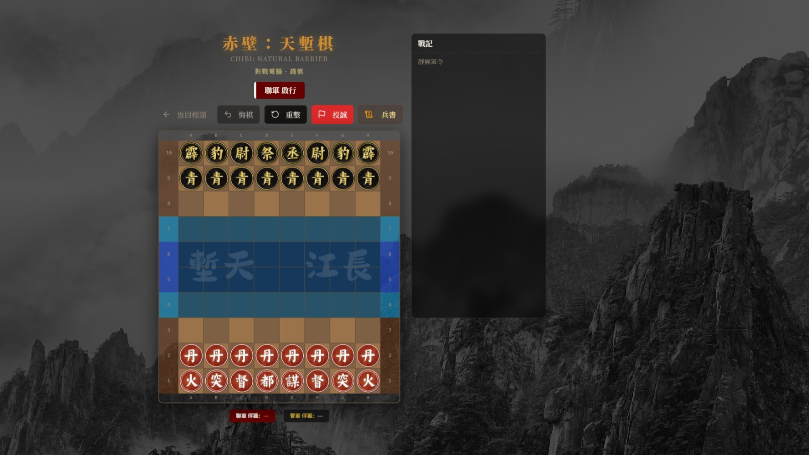
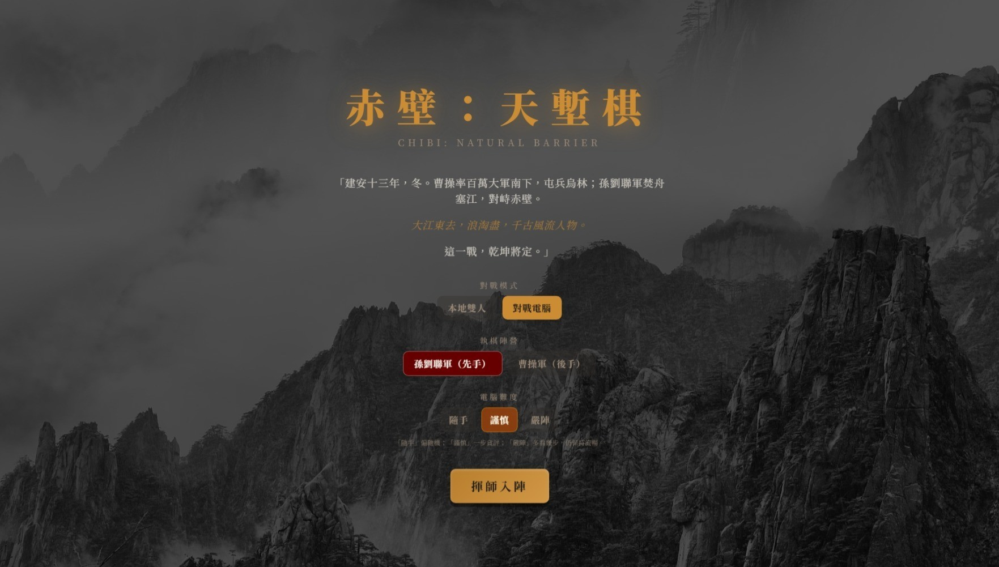
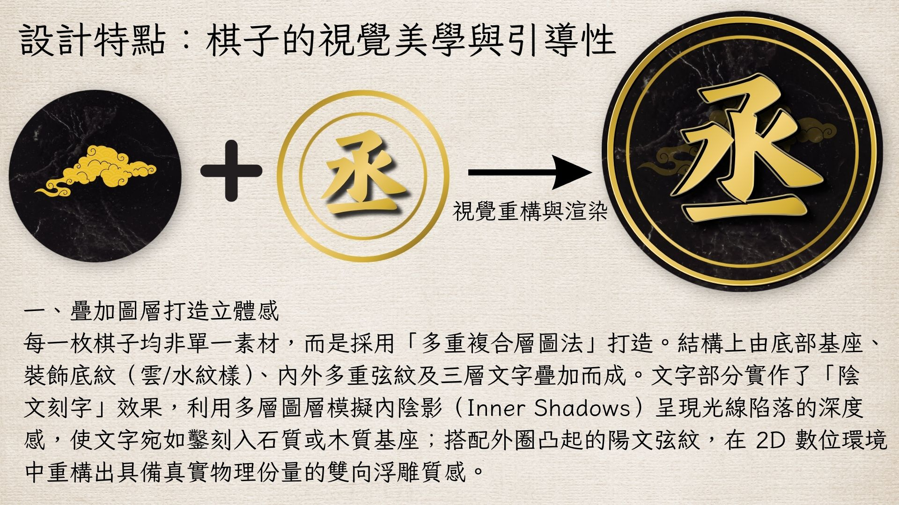
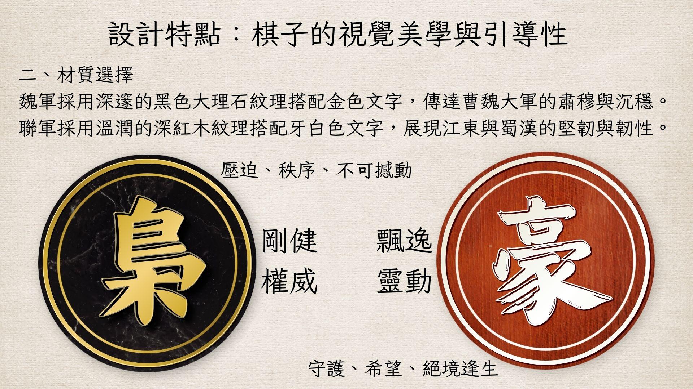
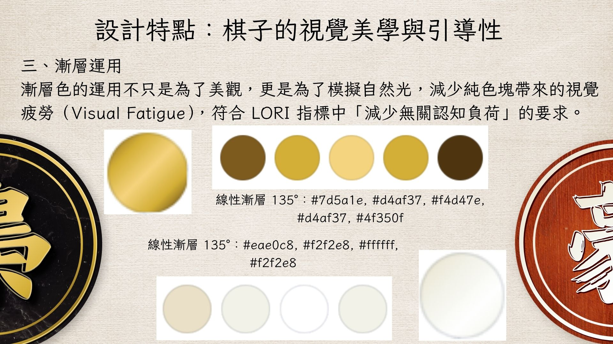
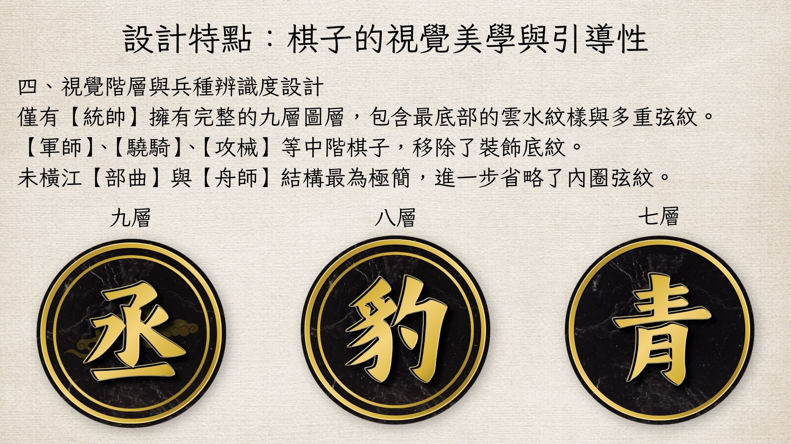

# Chibi: Natural Barrier (赤壁：天塹棋)

> A strategy board game set at the Battle of Red Cliff (208 AD). Two rival factions — the Sun-Liu Alliance and Cao Cao's army — clash across the Yangtze River, with terrain that transforms pieces and faction-specific units.

**[Live Demo](https://chaser940428-pixel.github.io/chibi-natural-barrier/)** &nbsp;|&nbsp; Built with React + TypeScript + Vite

---

<table>
  <tr>
    <td></td>
    <td></td>
  </tr>
</table>

---

## What it is

A historically-grounded chess variant where the battlefield mechanics reflect the actual battle. The Yangtze River (長江天塹) is not decoration — it changes what pieces can do. Navy units transform into warships when they enter the river zone, gaining expanded movement. Infantry that cross the river and reach the enemy's back line are promoted to heroes (豪傑/梟雄). Fire attack pieces (火/霹) can capture at range by leaping over any piece — friendly or enemy — as a catapult platform.

The game log (戰記) records every move in period-accurate military terminology rather than generic chess notation.

---

## Factions

| Unit type | Alliance (Red) | Cao Cao (Black) | Historical basis |
|-----------|:--------------:|:---------------:|-----------------|
| Commander (統帥) | 都 | 丞 | Sun-Liu coalition leadership vs. Cao Cao as Chancellor |
| Strategist (軍師) | 謀 | 祭 | Zhuge Liang's advisory role vs. Cao Cao's ritual officers |
| Naval Cmdr (舟師) | 督 | 尉 | Water Army Commander (南軍) vs. land officers assigned to ships (北軍) |
| Warship (戰船) | 舸 | 艨 | Fast fire-ships (走舸) vs. armored vessels (艨艟) |
| Cavalry (驍騎) | 突 | 豹 | Jiangdong shoreline assault unit (突將) vs. Tiger-Leopard Cavalry (虎豹騎) |
| Infantry (部曲) | 丹 | 青 | Elite Danyang soldiers (Sun family's founding force) vs. Qingzhou Infantry (Cao Cao's backbone) |
| Hero (豪傑/梟雄) | 豪 | 梟 | Promoted infantry — unlocked when 部曲 reaches the enemy baseline |
| Fire/Siege (攻械) | 火 | 霹 | Fire attack (decisive tactic at Red Cliff) vs. Trebuchet (霹靂車, used at Guandu) |

---

## Game mechanics

**Board:** 8 columns (A–H) × 10 rows (1–10)

**Zones:**
- Yangtze Trench (長江天塹): rows 4–7 — transforms Navy into Warships
- River Line (江線): row 5 (Alliance) / row 6 (Cao Cao) — Infantry crossing here gain lateral movement permanently
- Back Line (底線): row 1 / row 10 — Infantry reaching here are promoted to Hero

**Piece transformation:**
- Navy enters rows 4–7 → activates as Warship (moves 1–2 squares in any direction, cannot jump)
- Warship exits rows 4–7 → reverts to Navy
- Infantry crosses the river line → permanently unlocks sideways movement
- Infantry reaches back line → promotes to Hero (moves 1–2 squares, can leaping-capture)

**Fire/Siege (攻械 — 火/霹):** Moves 1 square orthogonally. Captures at unlimited range in a straight line, but only by jumping over exactly one piece (the "platform", 炮架) — identical to Chinese chess cannon mechanics.

**Win condition:** Capture the enemy Commander.

**Draw conditions:** Three-fold repetition, stalemate.

---

## AI

Three difficulty levels, all play as the selected faction:

| Level | Algorithm | Behavior |
|-------|-----------|----------|
| Easy (隨手) | Random | Picks any legal move uniformly at random |
| Medium (謹慎) | Greedy + position evaluation | Scores all moves using piece values + positional bonuses; selects from top 3 with random perturbation to avoid fixed lines |
| Hard (嚴陣) | Minimax with alpha-beta pruning | Depth-2 search tree with capture-first move ordering; evaluates material balance, positional bonuses, and check status |

The evaluation function weights:

```
Commander: 100,000  Strategist: 900  Hero: 750  Cavalry: 550
Navy: 500  Siege: 480  Infantry: 200
Navy-in-river bonus: +250
```

---

## Tech stack

| Layer | Tool |
|-------|------|
| UI framework | React + TypeScript |
| Styling | Tailwind CSS + shadcn/ui |
| Build | Vite |
| Game logic | Hand-written in TypeScript (`src/game/`) |

---

## Project structure

```
src/
├── game/
│   ├── types.ts      # Board, Piece, GameState, Position types
│   ├── engine.ts     # Move validation, piece transformation, win/draw detection
│   ├── ai.ts         # Easy/medium/hard AI — greedy and minimax with alpha-beta
│   └── sounds.ts     # Audio feedback
├── components/
│   ├── GameBoard.tsx      # Board rendering and interaction
│   ├── GamePiece.tsx      # Piece visuals
│   ├── MoveHistory.tsx    # 戰記 game log
│   ├── StartScreen.tsx    # Mode/faction/difficulty selection
│   └── BingshuDialog.tsx  # In-game rulebook
└── pages/
    └── Index.tsx     # Game page
```

---

## Development

```bash
# Install dependencies
bun install

# Start dev server
bun run dev

# Build
bun run build
```

---

## How it was built

Started with Lovable AI to prototype the UI and board layout. When the AI credit ran out, exported the project to GitHub and continued locally using Claude and Cursor — implementing the complete game engine from scratch: move validation, piece transformation state machine, three-fold repetition detection, stalemate detection, and all three AI difficulty levels.

The piece artwork was created in Canva using layered assets to produce a raised 3D coin effect, then exported and embedded as images.

---

## Piece Design

Each piece is composed of multiple layers — marble/wood base texture, decorative cloud/water patterns, concentric ring borders, and a three-layer engraved character — to simulate a physical coin with depth and weight. Higher-rank pieces (统帅) have 9 layers; pawns (部曲) use a simplified 7-layer structure to create visual hierarchy at a glance.

<table>
  <tr>
    <td></td>
    <td></td>
  </tr>
  <tr>
    <td></td>
    <td></td>
  </tr>
</table>
